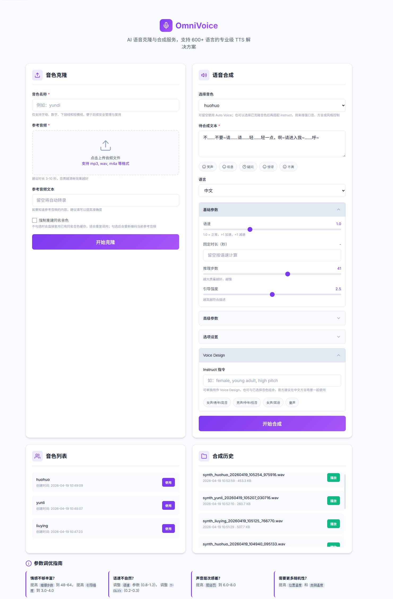

# OmniVoice 本地语音克隆服务

基于 [k2-fsa/OmniVoice](https://github.com/k2-fsa/OmniVoice) 的本地 Web 服务，提供音色克隆、语音合成、Voice Design、Auto Voice，以及一套面向中文场景的服务层增强。



## 当前能力

- 支持 `音色克隆`、`Voice Design`、`Auto Voice`
- 支持 `已克隆音色 + instruct` 组合使用
- 支持参考音频自动体检
  - 上传时自动打分
  - 自动提示时长、静音、削波、响度、采样率等风险
  - 克隆前可根据风险弹窗确认
- 支持文本驱动的自动韵律增强
  - 按短语、转折点和强停顿切分文本
  - 识别疑问、感叹、惊讶、叹息、耳语、催促等线索
  - 分段微调语速、停顿、少量非语言标签和音高提示
  - 在 `……`、换行、耳语/叹息等场景下优先保留停顿
- 支持同名音色强制重建
- 支持输出历史列表与播放
- 支持上传大小限制、文件名校验和输出路径安全检查
- 自动探测 `ffmpeg`

## 这不是的能力

- 不是训练型说话人微调系统
- 不是情感 TTS 专模
- 不能保证“只要一段参考音频就自动生成影视配音级情绪表现”

当前实现更适合：

- 本地验证 OmniVoice 克隆效果
- 生成偏实用型的旁白、口播、角色台词
- 快速比较不同参考音频、不同参数、不同 instruct 的效果

## 项目结构

```text
xrilang-voice-clone-ominovoice/
├─ api/
│  └─ main.py
├─ core/
│  ├─ __init__.py
│  ├─ audio_quality.py
│  ├─ expressive_text.py
│  ├─ service_utils.py
│  └─ voice_clone_prompt.py
├─ static/
│  └─ index.html
├─ voices/
├─ outputs/
├─ config.example.py
├─ config.py
├─ requirements.txt
└─ 启动服务.bat
```

## 环境要求

- 已准备好 `conda` 环境，默认环境名为 `omnivoice`
- Python 3.10+
- 建议使用 CUDA GPU
- 需要 `ffmpeg`
- 需要 Hugging Face Token 用于下载 OmniVoice 模型

## 安装与启动

### 1. 激活环境

```bash
conda activate omnivoice
```

### 2. 安装依赖

```bash
pip install -r requirements.txt
```

如果 `torch` 尚未安装，请先按你的 CUDA 版本安装 PyTorch。

### 3. 配置

复制配置文件：

```bash
copy config.example.py config.py
```

然后在 `config.py` 中填写：

```python
HF_TOKEN = "hf_xxx"
```

服务也会优先读取系统环境变量中的 `HF_TOKEN`。

### 4. 启动服务

双击：

```text
启动服务.bat
```

或命令行启动：

```bash
conda run -n omnivoice python -m uvicorn api.main:app --host 127.0.0.1 --port 8000
```

启动后访问：

```text
http://127.0.0.1:8000
```

## 使用建议

### 参考音频建议

- 建议时长 `3-10 秒`
- 单人声、少混响、无 BGM、无明显环境噪声
- 尽量不要用情绪跨度过大的长音频
- 如果知道参考音频文本，建议填写 `ref_text`

### 为什么会“像了，但读得不够像人”

这是零样本语音克隆里很常见的问题，通常分成两层：

1. 音色像不像
2. 韵律和情感像不像

这个项目目前已经补了一层服务侧增强：

- 默认推理步数提升到 `32`
- 新增自动韵律规划

它能改善“整段一个腔调读完”的情况，但仍然不等于完整的情感 TTS 模型。

### 自动韵律的工作方式

自动韵律默认开启，且只在“非固定时长模式”下工作。

它会：

- 按短语、转折词和强停顿切分文本，而不只是整句一刀切
- 识别 `？`、`！`、`……`、换行，以及 `但是 / 结果 / 原来 / 快点` 这类线索
- 对疑问、感叹、惊讶、叹息、耳语、催促等片段做轻微语速调整
- 在少量强情绪短句上自动补充非语言标签
- 对 `……`、换行、耳语和叹息片段优先使用“保停顿”生成策略，再做轻量裁边

如果你设置了固定时长 `duration`，系统会自动关闭自动韵律，因为两者目标冲突。

## API

### 健康检查

```http
GET /api/health
```

### 参考音频体检

```http
POST /api/voice/analyze
Content-Type: multipart/form-data
```

字段：

- `ref_audio`: 参考音频

返回内容包括：

- 总分
- 风险等级
- 响度 / 削波 / 静音占比 / 头尾静音 / 采样率等指标
- 风险提醒与优化建议

### 克隆音色

```http
POST /api/voice/clone
Content-Type: multipart/form-data
```

字段：

- `voice_name`: 音色名称
- `ref_audio`: 参考音频
- `ref_text`: 可选，参考音频文本
- `rebuild`: 可选，是否强制重建

说明：

- 克隆接口会附带返回本次参考音频的体检结果

### 音色列表

```http
GET /api/voice/list
```

### 合成语音

```http
POST /api/synthesize
Content-Type: multipart/form-data
```

字段：

- `text`: 待合成文本
- `voice_id`: 可选，已克隆音色 ID
- `language`: 语言
- `speed`: 语速
- `duration`: 固定时长
- `num_step`: 推理步数
- `guidance_scale`: 引导强度
- `t_shift`
- `layer_penalty_factor`
- `position_temperature`
- `class_temperature`
- `denoise`
- `preprocess_prompt`
- `postprocess_output`
- `audio_chunk_duration`
- `audio_chunk_threshold`
- `auto_prosody`: 是否开启自动韵律
- `auto_prosody_debug`: 是否返回韵律规划调试信息
- `instruct`: Voice Design 指令

### 合成历史

```http
GET /api/output/list
```

### 播放或下载输出

```http
GET /api/output/{filename}
```

## 当前前端说明

当前页面内置了三类操作：

- 音色克隆
- 语音合成
- 历史结果浏览

前端默认展示的语言选项是：

- Chinese
- English
- Japanese

如果你希望暴露更多 OmniVoice 支持的语言，可以继续扩展前端下拉框；API 本身并不只限制这三项。

## 已知局限

- 参考音频体检是启发式评分，不等于专业音频评测
- 自动韵律是服务层增强，不是模型原生情感控制
- 当前自动韵律更像“轻量导演层”，能明显改善平铺直叙，但还不能替代专门的情感 TTS 模型
- 对极强表演型文本、多人对话、戏剧化情绪切换，仍建议人工插入标签或分句合成
- 长文本虽然支持分段，但跨句情绪连贯性仍有限

## 推荐调优方向

如果你觉得“克隆后还是不够像、不够有感情”，优先级建议是：

1. 先换更干净的参考音频
2. 再补 `ref_text`
3. 再尝试 `voice clone + instruct`
4. 再调 `num_step / guidance_scale / speed`
5. 最后再动更高级参数

## 安全说明

- `voices/` 和 `outputs/` 是本地缓存目录，不建议直接暴露到公网
- 如果要对外提供服务，建议补充：
  - 鉴权
  - 限流
  - 异步任务队列
  - 日志与监控

## 致谢

- [k2-fsa/OmniVoice](https://github.com/k2-fsa/OmniVoice)
- [Hugging Face OmniVoice Model Card](https://huggingface.co/k2-fsa/OmniVoice)
